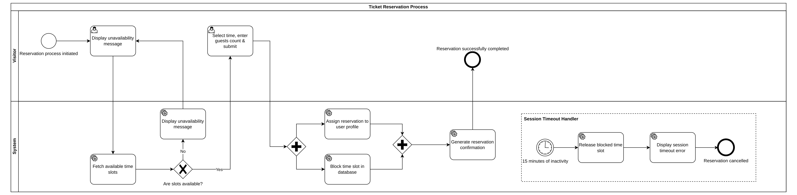
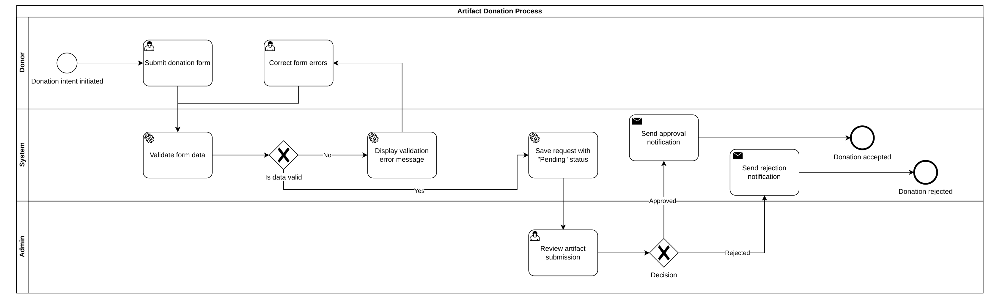
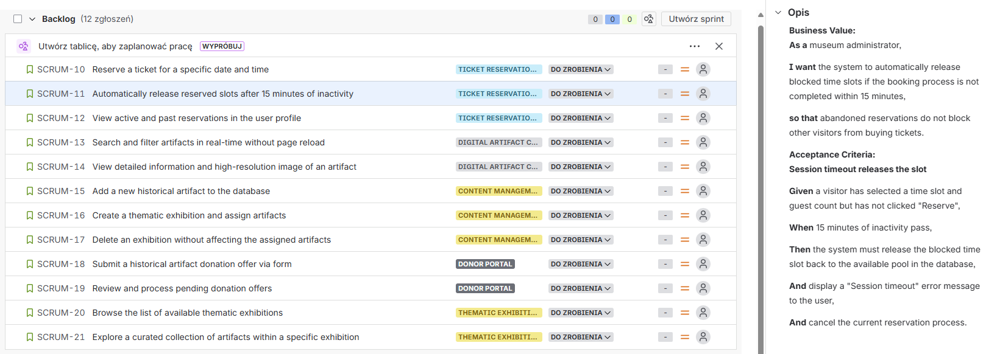

# 🏛️ Museum Management System

[](https://www.java.com/)
[](https://spring.io/projects/spring-boot)
[](https://reactjs.org/)
[](https://www.postgresql.org/)
[](https://www.docker.com/)

A robust Full-Stack application designed for modern museum administration. The system facilitates the digital management of exhibits, exhibitions, and provides a seamless browsing experience for visitors.

🔗 **Live Demo:** [https://muzeum-wrzesien1939-1.onrender.com/](https://muzeum-wrzesien1939-1.onrender.com/) (WIP)

---

## 🚀 Key Features

* **Exhibits Management** – CRUD operations for museum artifacts with categorization.
* **Exhibitions Planning** – Organizing exhibits into curated collections.
* **Secure Authentication** – Role-based access control using **JWT (JSON Web Tokens)**.
* **Public Access** – Read-only view for museum visitors without registration.
* **Responsive Design** – Optimized for desktop and mobile devices.

---

## 📊 Business Analysis & System Design

This project goes beyond just code. It includes comprehensive business and system analysis documentation, demonstrating a clear understanding of user flows and system architecture.

### 1. Business Process Modeling (BPMN 2.0)
The system logic is documented using BPMN standards to handle complex interactions:
* **:** Features parallel gateways (AND) for database/profile synchronization and Event Sub-processes (Timers) for handling 15-minute session timeouts.
* **:** Illustrates a multi-lane back-office approval process between Donors, the System, and Museum Administrators.

### 2. Agile Requirements (Jira & Scrum)
The development was driven by a well-structured Agile Backlog:
* Structured into **Epics** (e.g., *Digital Artifact Catalog, Donor Portal, CMS*).
* Detailed **User Stories** written in **BDD format** (`Given / When / Then`) ensuring clear Acceptance Criteria.
* 📸 *View Jira Backlog *
* 🔗 **Live Jira Board:** *Available upon request during the interview.*

---

## ⚙️ Configuration & Environment Variables

To run this project securely, the following environment variables need to be configured. The application uses `application.properties` to map these variables.

| Variable | Description | Example / Default |
| :--- | :--- | :--- |
| `SPRING_DATASOURCE_URL` | JDBC Connection String | `jdbc:postgresql://localhost:5433/museum_db` |
| `SPRING_DATASOURCE_USERNAME` | Database User | `postgres` |
| `SPRING_DATASOURCE_PASSWORD` | Database Password | `secure_password` |
| `JWT_SECRET_KEY` | Secret key for signing tokens | `YourSuperSecretKeyHere...` |
| `PORT` | Application Port | `8080` |

---

## 🏁 Getting Started

Follow these steps to set up the project locally.

### Prerequisites
* Java JDK 21
* Node.js (v18 or higher)
* Docker (recommended for Database)

### 1. Database Setup
The project includes a `docker-compose.yml` file to easily spin up the PostgreSQL database and pgAdmin.

1.  **Start the Database:**
    Run the following command in the root directory:
    ```bash
    docker-compose up -d
    ```

    * **Database:** Port `5433`, User: `admin`, Password: `admin_password`
    * **pgAdmin (GUI):** `http://localhost:5050` (Login: `admin@admin.com`, Pass: `admin`)

2.  **Connecting pgAdmin (Optional):**
    If you use the included pgAdmin, add a new server with:
    * **Host name/address:** `museum-db` (container name)
    * **Port:** `5432`
    * **Username:** `admin`
    * **Password:** `admin_password`

### 2. Backend Setup
Navigate to the root directory (where `build.gradle` is located).

1.  **Configure Environment:**
    The application is pre-configured to work out-of-the-box if you used the Docker command above (Port: `5433`, User: `admin`).
    *If you are using a custom database setup, ensure your environment variables or `application.properties` match your credentials.*

2.  **Run the Application:**
    Execute the following command based on your operating system:

    **Linux / macOS:**
    ```bash
    ./gradlew bootRun
    ```

    **Windows:**
    ```bash
    .\gradlew.bat bootRun
    ```

✅ The backend API will be available at: `http://localhost:8080`  
📄 Swagger Documentation: `http://localhost:8080/swagger-ui.html`

### 3. Frontend Setup
Open a new terminal and navigate to the `web` directory.

1.  **Install Dependencies:**
    ```bash
    cd web
    npm install
    ```


2.  **Run Development Server:**
    ```bash
    npm run dev
    ```

✅ The frontend application will be accessible at: `http://localhost:5173`

---
