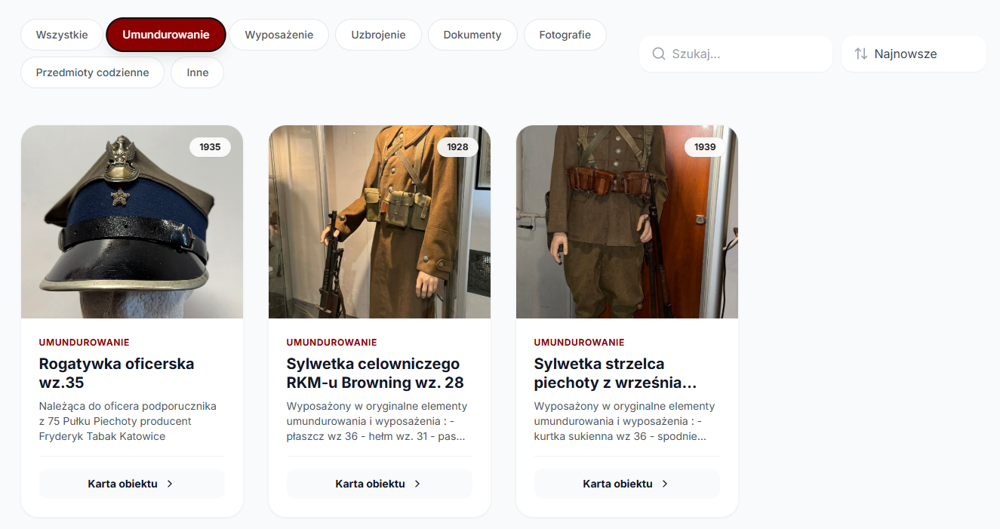
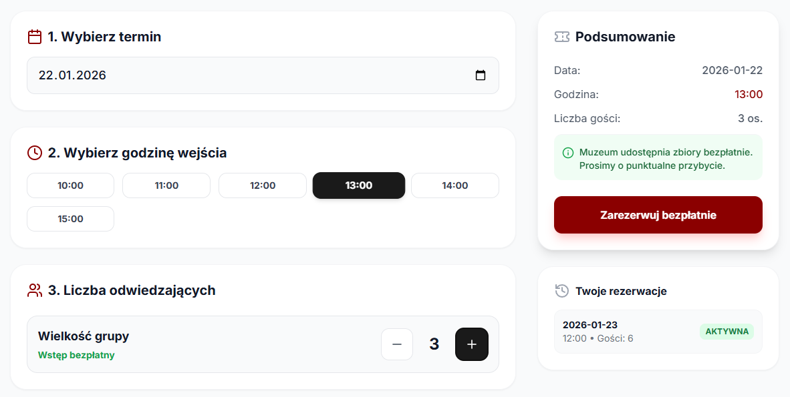
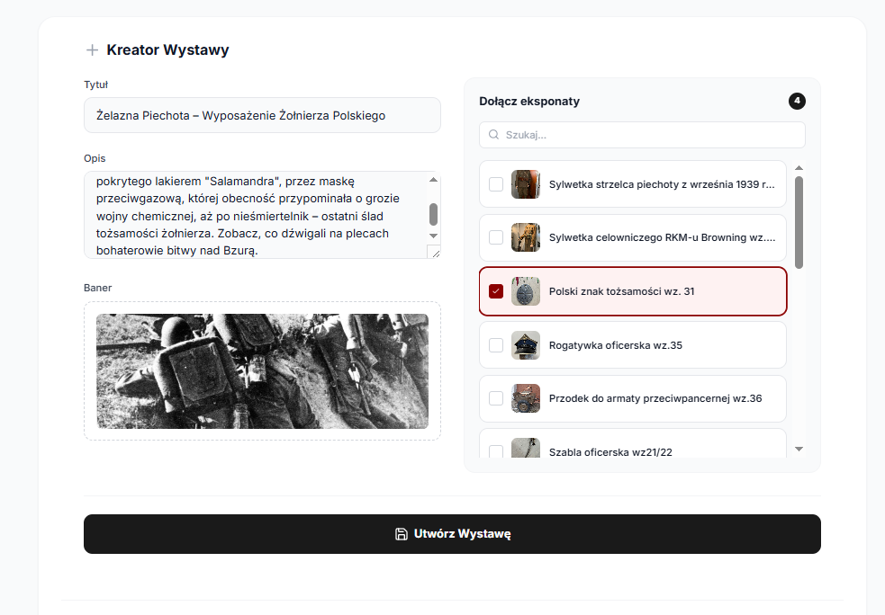

# Dokumentacja Użytkowa Systemu
## „Muzeum Wrzesień 1939”

---

## 1. Wstęp

System **„Muzeum Wrzesień 1939”** to nowoczesna aplikacja internetowa służąca do cyfrowej prezentacji zbiorów historycznych, edukacji poprzez wystawy tematyczne oraz obsługi ruchu turystycznego (rezerwacje).

Aplikacja została podzielona na dwa główne moduły:

- **Panel Zwiedzającego (Gość)** – ogólnodostępny
- **Panel Administratora** – zabezpieczony, przeznaczony do zarządzania treścią

---

## 2. Instrukcja dla Zwiedzającego (Gość)

### 2.1. Przeglądanie Katalogu Zbiorów

Moduł **Katalogu** to serce cyfrowego muzeum, umożliwiające swobodne przeszukiwanie bazy eksponatów.

#### Funkcjonalności:

- **Wyszukiwanie**  
  Wpisz frazę (np. *„Maska”*, *„Karabin”*) w polu wyszukiwania.  
  Wyniki są filtrowane natychmiastowo w czasie rzeczywistym.

- **Filtrowanie**  
  Kliknij wybraną kategorię (np. *Militaria*, *Dokumenty*, *Umundurowanie*), aby zawęzić listę wyświetlanych obiektów.

- **Szczegóły obiektu**  
  Kliknij przycisk **„Karta obiektu”**, aby otworzyć widok szczegółowy.  
  Dostępne informacje:
    - zdjęcie w wysokiej rozdzielczości,
    - rok produkcji,
    - pełny opis historyczny.

- **Wydajność**  
  Dzięki zastosowaniu technologii **Client-Side Caching**, przeglądanie i filtrowanie odbywa się błyskawicznie, bez konieczności przeładowywania strony.

---

### 2.2. Zwiedzanie Wystaw Tematycznych

Moduł **Wystawy** pozwala na oglądanie wyselekcjonowanych kolekcji, przygotowanych przez kustoszy w formie narracyjnej.

- **Wybór wystawy**  
  W zakładce **„Wystawy”** dostępna jest lista aktywnych ekspozycji, np.:
    - *Obrona Poczty Gdańskiej*
    - *Uzbrojenie Piechoty*

- **Widok kolekcji**  
  Po wejściu w wybraną wystawę system wyświetla wyłącznie przypisane do niej eksponaty, co umożliwia poznawanie historii w uporządkowany, tematyczny sposób.

---

### 2.3. Rezerwacja Biletu

Aby zaplanować wizytę stacjonarną w muzeum:

1. Zaloguj się na swoje konto (lub zarejestruj, jeśli go nie posiadasz).
2. Przejdź do zakładki **Rezerwacje**.
3. Wybierz interesującą Cię datę w interaktywnym kalendarzu.
4. Wybierz jedną z dostępnych godzin  
   *(system automatycznie blokuje terminy w pełni zajęte)*.
5. Podaj liczbę osób i kliknij **„Zarezerwuj”**.
6. Potwierdzenie rezerwacji znajdziesz w sekcji **„Moje Rezerwacje”**.

---

### 2.4. Strefa Darczyńcy

Muzeum umożliwia społeczności wspieranie misji zachowania pamięci historycznej.

- **Lista Darczyńców**  
  W zakładce **„Darczyńcy”** znajduje się honorowa lista osób i instytucji, które wsparły muzeum finansowo lub przekazały pamiątki.

- **Zgłoszenie Darowizny**  
  Użytkownicy posiadający rodzinne pamiątki mogą skorzystać z formularza kontaktowego, aby zgłosić chęć przekazania eksponatu:
    - do archiwum cyfrowego,
    - do fizycznego magazynu muzeum.

---

## 3. Instrukcja dla Administratora

### 3.1. Dostęp do Panelu

Funkcje zarządcze są ukryte dla zwykłych użytkowników.

- Wymagane jest zalogowanie na konto z rolą **`ROLE_ADMIN`**.
- Po autoryzacji interfejs aplikacji zmienia się, udostępniając:
---

### 3.2. Zarządzanie Eksponatami

Administrator posiada pełną kontrolę nad bazą danych zbiorów.

- **Dodawanie**  
  Przycisk **„Dodaj nowy eksponat”** otwiera formularz zawierający pola:
    - Nazwa
    - Opis
    - Rok produkcji
    - Kategoria
    - Zdjęcie

- **Edycja**  
  Możliwość szybkiej korekty danych (np. literówek) bezpośrednio z poziomu karty obiektu.

- **Usuwanie**  
  Trwałe usunięcie obiektu z bazy danych.

---

### 3.3. Kuratela Wystaw (Zarządzanie Kolekcjami)

Administrator może tworzyć wirtualne wystawy na podstawie obiektów dostępnych w magazynie.

- **Tworzenie wystawy**
    - tytuł,
    - opis,
    - grafika tła.

- **Kompozycja**
    - przypisywanie eksponatów do wystawy poprzez wybór z listy,
    - jeden eksponat może należeć do wielu wystaw jednocześnie.

- **Integralność danych**
    - usunięcie wystawy **nie usuwa** eksponatów,
    - obiekty wracają do ogólnego magazynu.

---

### 3.4. Zarządzanie Darczyńcami

Panel administracyjny umożliwia:

- weryfikację zgłoszeń darowizn,

---
