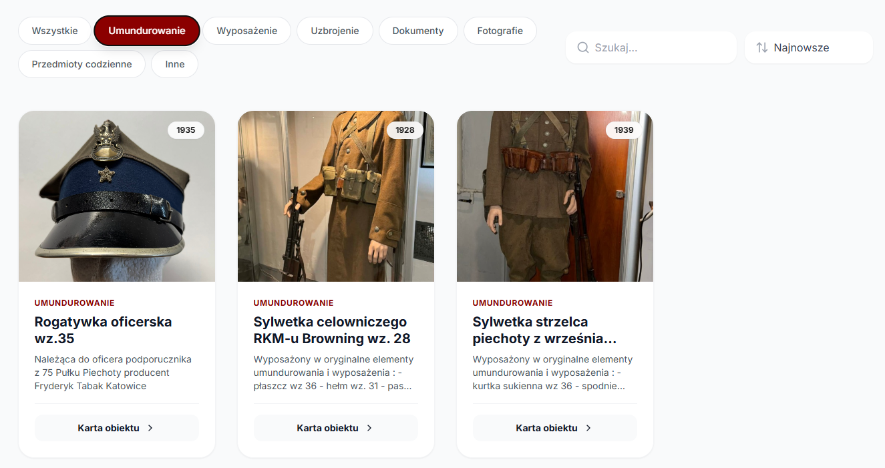
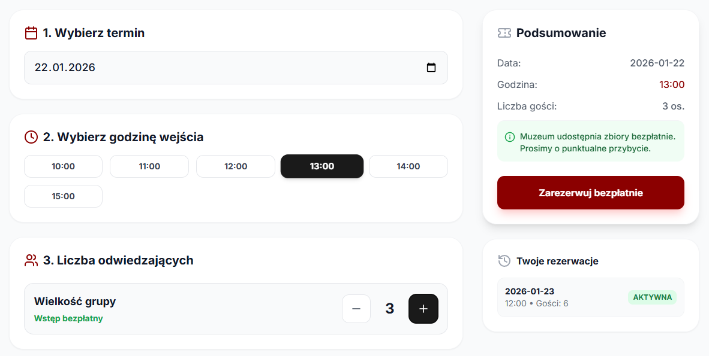
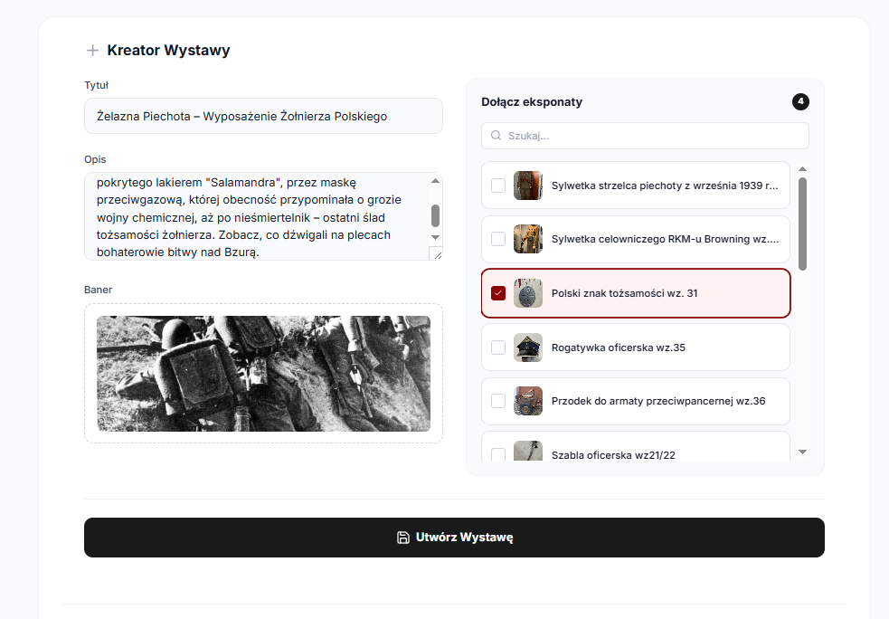

# System User Manual
## "September 1939 Museum"

---

## 1. Introduction

The **"September 1939 Museum"** system is a modern web application designed for the digital presentation of historical collections, education through thematic exhibitions, and handling tourist traffic (reservations).

The application is divided into two main modules:

- **Visitor Panel (Guest)** – publicly accessible
- **Administrator Panel** – secured, intended for content management

---

## 2. Visitor Guide (Guest)

### 2.1. Browsing the Artifact Catalog

The **Catalog** module is the heart of the digital museum, allowing users to freely search the artifact database.

#### Features:

- **Search** Enter a phrase (e.g., *"Mask"*, *"Rifle"*) in the search bar.  
  Results are filtered instantly in real-time.

- **Filtering** Click a specific category (e.g., *Militaria*, *Documents*, *Uniforms*) to narrow down the list of displayed items.

- **Artifact Details** Click the **"Artifact Card"** button to open the detailed view.  
  Available information:
  - high-resolution image,
  - production year,
  - full historical description.

- **Performance** Thanks to **Client-Side Caching** technology, browsing and filtering are lightning-fast, without requiring a page reload.

---

### 2.2. Exploring Thematic Exhibitions

The **Exhibitions** module allows users to view selected collections curated by museum staff into a narrative format.

- **Exhibition Selection** In the **"Exhibitions"** tab, there is a list of active displays, e.g.:
  - *Defense of the Polish Post in Danzig*
  - *Infantry Weaponry*

- **Collection View** Upon entering a selected exhibition, the system displays only the artifacts assigned to it, enabling users to explore history in a structured, thematic way.

---

### 2.3. Ticket Reservation

To plan an in-person visit to the museum:

1. Log in to your account (or register if you do not have one).
2. Go to the **Reservations** tab.
3. Select your preferred date in the interactive calendar.
4. Choose one of the available time slots  
   *(the system automatically blocks fully booked slots)*.
5. Enter the number of guests and click **"Reserve"**.
6. You will find the reservation confirmation in the **"My Reservations"** section.

---

### 2.4. Donor Zone

The museum allows the community to support the mission of preserving historical memory.

- **Submitting a Donation** Users possessing family memorabilia can use the contact form to offer an artifact:
  - to the digital archive,
  - to the museum's physical inventory.

---

## 3. Administrator Guide

### 3.1. Panel Access

Management features are hidden from regular users.

- Login with a **`ROLE_ADMIN`** account is required.
- After authorization, the application interface changes, providing access to:

---

### 3.2. Artifact Management

The administrator has full control over the collections database.

- **Adding** The **"Add new artifact"** button opens a form with the following fields:
  - Name
  - Description
  - Production year
  - Category
  - Image

- **Editing** Ability to make quick data corrections (e.g., typos) directly from the artifact card.

- **Deleting** Permanent removal of the item from the database.

---

### 3.3. Exhibition Curating (Collection Management)

The administrator can create virtual exhibitions based on items available in the inventory.

- **Creating an exhibition**
  - title,
  - description,
  - background graphic.

- **Composition**
  - assigning artifacts to the exhibition by selecting them from a list,
  - one artifact can belong to multiple exhibitions simultaneously.

- **Data Integrity**
  - deleting an exhibition **does not delete** its artifacts,
  - objects return to the general inventory.

---

### 3.4. Donor Management

The administrative panel allows for:

- reviewing and verifying donation submissions